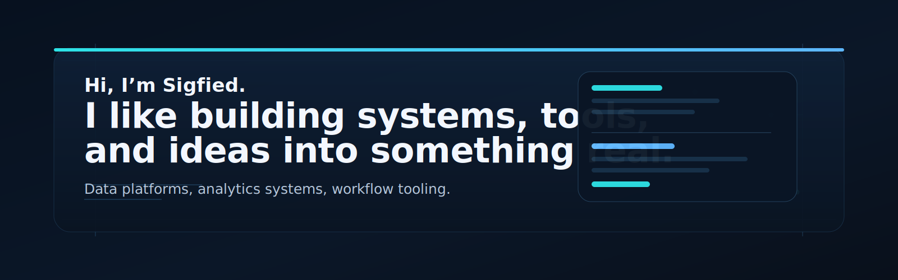

# Sigfied

> I like building systems, tools, and ideas into something real.

I build data platforms, analytics systems, and workflow tooling with a bias toward clear architecture and useful interfaces.

## Selected Work

### Polars Analytics Platform
An internal analytics platform I led end to end, covering real-time warehousing, analysis models, backend services, metadata, and frontend analysis pages.
I designed it as a full product system rather than a single query service, with StarRocks as both the real-time warehouse base and the online analysis engine.

### Iceberg + Hudi Lakehouse
A modern lakehouse pipeline for event data and user attributes, built around Kafka, Flink, Iceberg, Hudi, PostgreSQL, and Spark maintenance jobs.
I split event and user data by access pattern, added metadata governance into the ingestion path, and treated long-term table maintenance as part of the architecture.

### HDFS + Kudu + Hive Real-Time Pipeline
A full-chain data foundation from service logs to Kafka, Flink, Kudu, Spark, and Hive/HDFS for near-real-time querying and offline warehousing.
I used Kudu as a real-time query layer, built schema evolution and partition governance into the pipeline, and connected streaming and offline analytics into one system.

## What I'm Into

- Analytics platforms where data models and product surfaces evolve together.
- Data infrastructure that treats storage, compute, and metadata as one system.
- Workflow tooling and automation that remove repeated operational work.

## How I Think

- Start with a clean model before adding layers.
- Make the workflow obvious for the next person.
- Prefer useful systems over clever demos.

## Current Toolkit

Mostly Kotlin, Python, SQL, Kafka, Flink, Spark, and StarRocks, with product-facing work where the platform needs it.

## Links

- GitHub: https://github.com/Sigfied
- Email: ayayating1031@gmail.com
